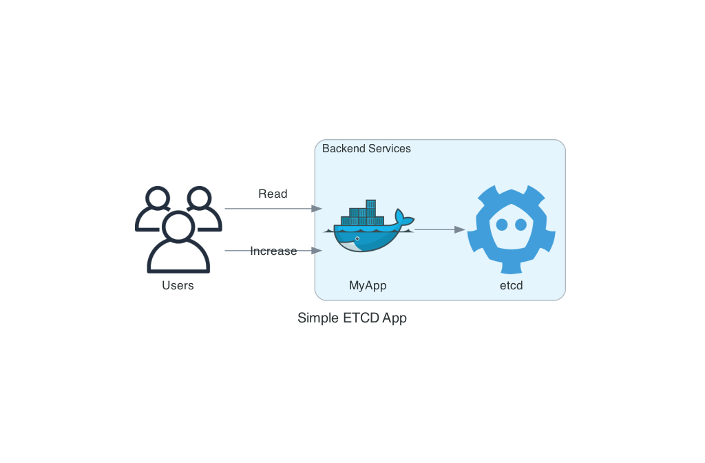

# Simple contanerized ectd app

## Description

This is a simple application written in python3 and [Flask](https://flask.palletsprojects.com/en/2.2.x/) will support two operations: Read a counter (initialized as 0 when you run the container) and increase a counter by one.

Increasing the counter count is a locking operation. In your request to increase the counter you have to send in the form the `sleep` argument assigned with an integer number of seconds that the request wiill take

  - If the request is longer than `ETCD_LOCK_TTL`, the lock will expire and the request will fail with `408` error.
  - If the you run two calls in parallel is taken, the second call to arrive will return `503` if the lock is in usage.

The lock is implemented as a key in [etcd v3.4](https://etcd.io/docs/v3.4/) using [etcd3 python library](https://github.com/kragniz/python-etcd3).



## Run the example

  1. Build App image.
  ```
  export APP_NAME=myapp
  export APP_VERSION=1.0
  docker build -t $APP_NAME:$APP_VERSION .
  ```

  2. Create a container running etcd.

  ```
  export ETCD_CONTAINER_NAME=my-etcd
  export ETCD_PORT=2379
  docker run -d \
  --name $ETCD_CONTAINER_NAME \
  -p $ETCD_PORT:$ETCD_PORT \
  quay.io/coreos/etcd:v3.4.15 \
  /usr/local/bin/etcd \
  --name $ETCD_CONTAINER_NAME \
  --advertise-client-urls http://0.0.0.0:$ETCD_PORT \
  --listen-client-urls http://0.0.0.0:$ETCD_PORT
  ```

  3. Get etcd container's IP address.

  ```
  docker container inspect $ETCD_CONTAINER_NAME | grep IPAddress
  ```

  4. Deploy App container. ***Note***: use the etcd container IP address obtained from previous command to assign value to `ETCD_HOST`.

  ```
  export HTTP_PORT=8080
  export ETCD_HOST=172.17.0.2
  export ETCD_PORT=2379
  export ETCD_LOCK_KEY=/my/lock
  export ETCD_LOCK_TTL=60
  docker run --rm -p $HTTP_PORT:$HTTP_PORT -e HTTP_PORT=$HTTP_PORT -e ETCD_HOST=$ETCD_HOST -e ETCD_PORT=$ETCD_PORT -e ETCD_LOCK_KEY=$ETCD_LOCK_KEY -e ETCD_LOCK_TTL=$ETCD_LOCK_TTL $APP_NAME:$APP_VERSION
  ```

  5. The endpoints of these app are:
   - `/read_counter`: Get the current value of the counter. HTTP request type is `GET`.
   - `/increase_counter`: Increase the value of the counter by 1 if Lock available. HTTP request type is `POST`.
